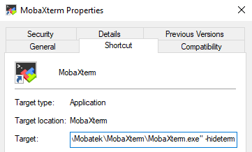
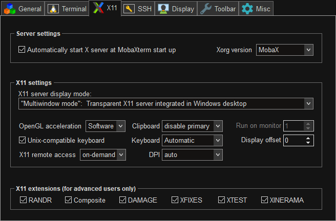

# MobaXterm Home Edition

> [!CAUTION]
> Using MobaXterm on Windows is not recommended, as WSLg provides significantly better rendering performance and is
> supported out of the box.

[**MobaXterm Home Edition**](https://mobaxterm.mobatek.net/download.html) (X11 server) - lets you display applications (
e.g. IntelliJ IDEA) from JDVM on your Windows.

## 🛠️ First Setup and Start

### Setup

MobaXterm Home Edition consumes really low RAM (around 20MB, with IntelliJ IDEA open only 43,5MB RAM), so I suggest to
make it run with Windows startup:

* Run `Windows Key` + `R` shortcut and type: `shell:startup`
* Add MobaXterm shortcut to `Autostart` directory
* To start MobaXterm immediately minimized into the system tray add `-hideterm` property after `MobaXterm.exe"` in the
  Target field in Shortcut tab:



Also, consider changing default settings. You can change the settings to below ones by right-clicking MobaXterm tray
icon -> Show terminal -> Settings -> Configuration -> X11:



Also in `Settings` -> `Keyboard Shortcuts`:

- Set `Show / hide popup terminal` to `<none>` as it will clash with IntelliJ shortcut for extracting method.

Then, to turn MobaXterm window back to tray icon go to: View -> Iconify MobaXterm. You can also do it with shortcut:
`CTRL + M`.

### Start

In the Docker Run command pass the following environment variable:

```shell
--env DISPLAY="host.docker.internal:0.0"
```

and remove:

```shell
--mount type=bind,source=/run/desktop/mnt/host/wslg/.X11-unix,target=/tmp/.X11-unix
```
